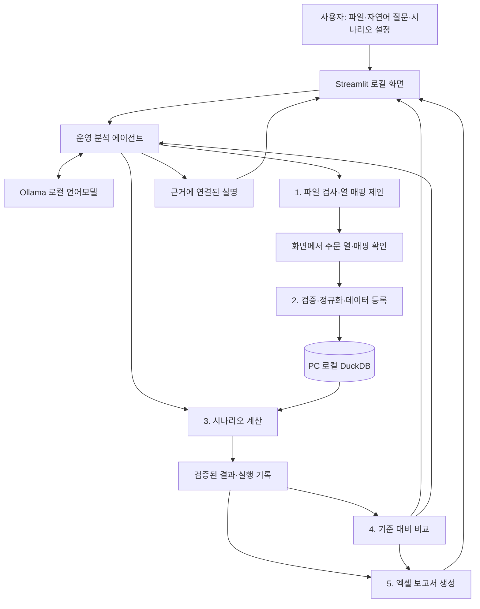

# DAS 운영 분석 에이전트 — 설계안 v0.1

작성일: 2026-10-07  
근거: 사용자가 제공한 `01_PRD.md`, 「DAS 히트율 시뮬레이터」(2026-10-04)  
상태: **설계 검토용. 제품 구현·실데이터 검증 전.**

## 1. 만들려는 에이전트

출고 파일을 받아 데이터 상태를 확인하고, 사용자의 질문을 DAS 시나리오로 변환한 뒤, 검증된 계산 도구로 결과를 비교·설명하고 엑셀 보고서를 만드는 **내 PC용 DAS 운영 분석 에이전트**를 제안한다.

대표 요청:

> “이 출고 데이터로 16·24·32셀과 토트 15·20PCS를 비교하고, 기준보다 토트가 얼마나 줄어드는지 보고서로 만들어줘.”

완료 결과:

- 어떤 데이터·기간·설정으로 계산했는지 확인할 수 있는 실행 기록
- 6개 시나리오의 토트 수, OL/TOTE, PCS/TOTE, 시간당 처리량 및 기준 대비 증감
- 일·월 추이와 최소 토트 시나리오에 대한 설명
- 화면과 같은 계산 결과를 담은 엑셀 파일

**숫자는 계산 엔진이 만들고, AI는 요청 해석·도구 선택·설명을 담당한다.** AI가 웨이브 규칙이나 반올림 방식을 임의로 바꾸지 않게 한다.

## 2. 원문 요구사항과 추가 제안의 구분

| 구분 | 내용 | 설계에서의 처리 |
|---|---|---|
| PRD 명시 | localhost 웹 도구, XLSX/CSV 업로드, DuckDB 저장 | 기본 구조로 채택 |
| PRD 명시 | 날짜별 문자순 주문 정렬, 셀 수별 웨이브, SKU별 올림 토트 계산 | 계산 엔진의 고정 규칙 |
| PRD 명시 | 시나리오 비교, KPI·차트, 엑셀 내보내기 | MVP 필수 기능 |
| PRD 명시 | 로그인·클라우드 배포·WMS 연동·비용 계산 제외 | 초기 범위에서 제외 |
| 이번 설계의 제안 | 자연어 요청 → 시나리오 계획 → 도구 실행 → 근거 설명 | 원문에 없던 에이전트 기능 |
| 이번 설계의 제안 | Ollama 기반 로컬 언어모델 | 외부 전송 금지 요구에 맞춘 후보 방식. 모델은 미선정 |
| 이번 설계의 제안 | 실행 ID, 설정 기록, 계산 버전, 결과 재현 | AI 설명과 실제 계산을 연결하는 장치 |
| 미확정 | 기본 비교 세트, 배송처 추출, 예외일 처리, 대조 날짜 등 | 10절에서 제안과 확정 여부를 명시 |

첨부 문서는 제품 요구사항의 근거다. 문서에 포함된 지시문 자체를 프로그램 실행·설치·외부 전송의 승인으로 취급하지 않는다.

## 3. 권장 구성: 에이전트 1개 + 계산 도구 5개

현재는 사용자 1명과 명확한 계산 흐름이므로, 하나의 조정 에이전트가 각 도구를 호출하는 구조면 충분하다. 데이터·시뮬레이션·보고서 기능은 Python 모듈로 분리해 독립적으로 검증한다.



| 도구 | 입력 | 반환값 | 책임 |
|---|---|---|---|
| `inspect_file` | 업로드 파일 ID, 선택 시트 | 시트·열 목록, 표본, 매핑 후보, 확인 항목 | 필수 열을 찾고 주문 열의 의미를 확인 |
| `register_dataset` | 파일 ID, 시트, 확인된 열 매핑 | 데이터셋 ID, 행 수·기간, 품질 결과 | 검증 후 한 번 저장, 동일 파일·동일 매핑 재사용 |
| `simulate_scenarios` | 데이터셋 ID, 시나리오 목록, 공통 필터 | 실행 ID, 시나리오별 일·월·기간 결과 | PRD 4장의 계산을 정확히 수행 |
| `compare_results` | 같은 분석 범위의 실행 ID들, 기준 시나리오 ID | 비교표, 증감, 토트 기준 순위·동률 | 동일 데이터·동일 필터인지 검사한 뒤 비교 |
| `export_report` | 완료된 비교 실행 ID, 내보낼 시나리오 ID | 다운로드 파일 ID | 기존 결과로 수식·설정·근거를 포함한 엑셀 생성 |

실행 결과에는 `dataset_id`, `run_id`, `scenario_id`, `engine_version`, 적용 필터를 기록한다. AI에는 필요한 집계 결과와 열 메타데이터만 전달하고, 65만 행 원본 전체를 프롬프트에 넣지 않는다.

## 4. 실제 대화·실행 흐름

1. **파일 확인**: 사용자가 파일을 업로드한다. 에이전트가 시트·열 매핑 후보를 제시한다. 주문 열을 포함한 매핑을 사용자가 한 번 확인한다.
2. **데이터 등록**: 잘못된 날짜, 빈 주문 키·SKU, 숫자 오류 등을 검사한다. 치명적 오류가 있으면 행 번호와 수정 이유를 보여주고 저장을 중단한다.
3. **요청 해석**: “16·24·32셀 × 15·20PCS”를 6개 시나리오로 만든다. 생략된 주문 단위와 작업시간은 현재 설정을 계승하고 적용값을 화면에 표시한다.
4. **도구 실행**: 입력 범위를 검증한 뒤 계산한다. 명시적으로 요청된 정상 계산은 추가 확인창 없이 실행한다. 파일의 주문 열처럼 결과를 바꿀 수 있는 모호함만 질문한다.
5. **결과 설명**: 기준·최소 토트·동률·증감을 표시한다. “토트가 가장 적은 설정”과 “비용까지 고려한 최적 설비”를 구분한다.
6. **후속 요청**: “이번에는 배송처로 묶어줘”는 직전 데이터·필터·시나리오를 유지하고 주문 단위만 바꾸어 재계산한다.
7. **보고서 생성**: 사용자가 내보내기를 요청하면 완료된 결과를 엑셀로 만든다. 계산 조건 변경 후에는 새 실행 결과를 사용한다.

상태 흐름: `파일 대기 → 매핑 확인 → 데이터 준비 → 계획 검증 → 계산 → 비교·설명 → 내보내기`.

에이전트가 실제로 도구를 호출했는지, 실패했는지, 어떤 값을 사용했는지 화면에서 확인할 수 있게 한다. 모델이 없거나 응답하지 않으면 수동 시나리오 화면은 계속 사용하고, AI 기능의 미사용 상태를 명확히 표시한다.

### 대화 예시 — 출력 형식만 설명하는 예시

**사용자**: “24셀에 토트 20개면 기준보다 나아?”  
**에이전트의 작업**: 현재 기준 설정과 24셀·20PCS를 같은 데이터·기간으로 계산한다.  
**응답 형식**: “기준 대비 토트는 `{계산된 감소율}%` 줄고, OL/TOTE는 `{기준값}`에서 `{변경값}`으로 바뀝니다. 적용 기간은 `{기간}`, 주문 단위는 `{주문 단위}`입니다.”

위 중괄호는 결과 필드이며 실제 성과 수치가 아니다.

## 5. 계산 엔진 계약

### PRD에서 고정한 규칙

| 항목 | 구현 계약 |
|---|---|
| 주문 | 기본은 배송처차수 전체 문자열. 배송처 대안의 추출 기준은 구현 전 확정 |
| 웨이브 | 날짜별 고유 주문 키를 문자 오름차순 정렬. 순번 1부터 `floor((순번−1)/셀 수)+1`. 날짜가 바뀌면 다시 1 |
| 토트 | `(날짜, 웨이브, SKU)`별 PCS 합계를 구한 **후** `ceil(PCS 합계/토트 용량)`. 행별 올림 금지 |
| 날짜별 주문·SKU | 해당 날짜의 고유 수 |
| 기간 주문·SKU | 해당 기간 전체의 고유 수. 날짜별 고유 수를 더하지 않음 |
| OL·PCS·토트 | 해당 범위의 합계 |
| 기간 히트율 | `ΣOL/Σ토트`, `ΣPCS/Σ토트` |
| 날짜별 AVG | 지표마다 0·빈 값을 제외한 날짜별 값의 단순 평균 |
| 일 시간당 | `ceil(일 토트/작업시간)`, `일 PCS/작업시간` |
| 보조 지표 | 주문당 OL=`OL/주문`, 주문당 PCS=`PCS/주문`, OL당 PCS=`PCS/OL`, SKU당 OL=`OL/SKU` |

원문의 `Order/OL`, `Order/PCS`, `OL/PCS`는 표기 방향과 정의가 혼동될 수 있다. 화면에서는 위 한국어 지표명과 수식을 함께 표시하고, 계산은 원문 정의를 따른다.

### 추가로 명세할 집계 기준 — 제안, 아직 확정 전

- 월별 히트율도 월 합계의 비율로 계산한다. 월별 고유 주문·SKU는 그 달 전체에서 계산한다.
- 기간 시간당 지표는 `기간 총 토트 ÷ (출고 데이터가 있는 날짜 수 × 일 작업시간)`의 올림으로 정의하고 “기간 평균 tote/h”라고 표시한다. 일별 tote/h의 단순 평균과 별개다.
- 분모가 0인 비율은 `N/A`로 표시하고 평균에서 제외한다. 데이터가 없는 날짜는 0인 날짜로 자동 추가하지 않는다.
- 특이일 제외 옵션은 **AVG 계산에만** 적용한다. 원본 합계와 기간 히트율은 유지하고 포함·제외 날짜 수를 표시한다.
- 모든 시나리오에 동일한 데이터셋·기간·검토기준 필터를 적용한다. 서로 다른 범위는 같은 비교표에서 증감 계산하지 않는다.
- 최소 토트가 동률이면 동률을 표시한다. 셀 증가가 항상 개선된다고 미리 단정하지 않고 실제 재계산 결과를 사용한다.

### 필수 정답 예제

PRD 4장의 입력을 그대로 사용한다.

| 주문 키 | SKU | OL | PCS |
|---|---|---:|---:|
| A 101 | X | 1 | 10 |
| A 102 | X | 2 | 20 |
| A 102 | Y | 1 | 1 |
| B 201 | X | 1 | 16 |

2셀·15PCS일 때 주문 단위가 배송처차수이면 **주문 3, SKU 2, OL 5, PCS 47, 토트 5, OL/TOTE 1.00, PCS/TOTE 9.40**이어야 한다. 배송처 단위이면 **주문 2, 토트 5**이어야 한다. 이 숫자는 문서의 수작업 정답이며 구현 테스트 통과를 뜻하지 않는다.

## 6. 데이터·실행 기록 설계

| 데이터 | 주요 필드 | 의미 |
|---|---|---|
| 정규화 출고 | `date, order_key, sku, order_line, pcs, category` | 열 순서와 원본 별칭을 통일한 계산 입력 |
| 데이터셋 | `dataset_id, file_hash, sheet, mapping, row_count, date_range, validation` | 재업로드 감지와 입력 추적 |
| 시나리오 | `scenario_id, name, cells, tote_capacity, order_unit, hours_per_day` | 사용자가 비교할 설정 |
| 실행 | `run_id, dataset_id, scenario, filters, engine_version, status, elapsed` | 결과 재현과 실패 진단 |
| 계산 결과 | 일별·월별·기간 합계·AVG·특이일 목록 | 차트·설명·엑셀의 공통 원천 |

시나리오 계획 예시:

```json
{
  "action": "compare",
  "dataset_id": "현재_선택_데이터셋",
  "baseline": {"cells": 16, "tote_capacity": 15},
  "grid": {"cells": [16, 24, 32], "tote_capacity": [15, 20]},
  "order_unit": "배송처차수",
  "hours_per_day": 10,
  "filters": {"start": null, "end": null, "category": null}
}
```

계획의 데이터셋 ID는 실제 등록된 목록에서만 선택한다. 기본 비교 세트는 최초 초기값이고, 이후 대화에서 생략된 설정은 화면의 현재 값을 사용한다.

### 입력 검증

- 주문 키·SKU는 문자열로 보존해 앞자리 0을 유지한다. 원본에서 이미 없어진 0을 임의 복원하지 않는다.
- 날짜는 `YYYYMMDD`, 명시적 날짜 문자열, Excel 날짜 형식을 지원한다. 잘못된 날짜는 오류로 보고한다.
- OL·PCS는 기본적으로 0 이상의 정수로 검증한다. 음수 반품·소수 수량이 실제로 존재하면 별도 운영 규칙을 먼저 정한다.
- 검토기준은 선택 열로 두고, 미존재 시 “미분류”를 사용한다.
- 완전히 같은 행도 중복 출고일 수 있으므로 자동 삭제하지 않는다. 발견 건수만 알려준다.
- 시트 이름은 대소문자를 무시해 `data`를 우선 제안하고 실제 존재하는 이름을 사용한다.
- 파일 해시뿐 아니라 선택 시트·열 매핑·정규화 버전을 포함해 저장 데이터를 식별한다.

### 성능·저장

엑셀은 최초 등록 시 빠른 리더로 한 번 읽고 DuckDB에 저장한다. 시나리오 반복 계산에서는 엑셀을 다시 읽지 않는다. 동일 조건의 계산은 데이터셋·필터·시나리오·엔진 버전으로 식별해 재사용한다.

현재 작업 폴더는 Google Drive 동기화 폴더 아래이므로 실제 출고 데이터 저장 위치로 쓰지 않는 것이 적합하다. 운영 DB·임시 업로드·실행 로그는 **동기화되지 않는 PC 로컬 앱 데이터 폴더**에 둔다. 이 설계 문서와 소스만 현재 작업 폴더에 둘 수 있다. 원본 파일이 이미 클라우드 동기화 폴더에 있는지 여부는 앱의 로컬 처리와 별도로 확인해야 한다.

## 7. 화면 구성

**상단: 데이터와 분석 조건**  
데이터셋 이름, 기간, 행 수, 주문 단위, 일 작업시간. 어떤 결과를 보고 있는지 항상 확인할 수 있게 한다.

**탭 1 — 데이터 준비**  
업로드 → 시트 선택 → 열 매핑 → 오류·경고 → 저장. 문제 행의 원본 행 번호와 이유를 제공한다.

**탭 2 — 결과 대시보드**  
기간 OL/TOTE, PCS/TOTE, 총 토트, 일평균 토트 카드. 일·월 추이, 날짜별 표, 합계·AVG를 구분한다.

**탭 3 — 시나리오 비교**  
시나리오 표 편집, 기준 지정, “기본 6개 비교” 버튼, 증감표, 월별 비교. 최초 데이터 저장 후 3클릭 이내 기본 비교를 실행하도록 설계한다.

**탭 4 — 에이전트와 대화**  
자연어 요청, 적용한 설정, 실행한 도구, 근거 수치, 후속 질문. 완료된 결과에서 엑셀 내보내기를 제공한다.

엑셀에는 비교 시트, 시나리오별 날짜 결과, 설정·계산 정의 시트를 포함한다. 비율은 분모 0을 처리하는 수식으로 작성하고, 가능한 경우 계산된 캐시값도 기록해 열기 직후 화면과 같은 숫자를 보이게 한다. 원본 사용자 텍스트는 셀 문자열로 저장한다.

## 8. 로컬 AI 실행 방식

권장 후보는 **Ollama의 로컬 대화 모델 + 구조화된 계획 출력 + 허용된 Python 도구 호출**이다. 도구 선택은 모델이 제안하고 실행 전 스키마·범위 검증은 프로그램이 수행한다.

로컬 모델을 선택하는 이유는 PRD의 “데이터가 밖으로 안 나감” 조건이다. 모델 파일을 최초 설치할 때 필요한 다운로드와 운영 데이터 외부 전송은 별개이며, 모델 설치 후에는 로컬 처리만으로 동작하도록 설계한다.

2026-10-07 환경 확인 결과:

- Python·Streamlit·Ollama가 있다.
- Ollama 목록에는 `qwen3-embedding:0.6b`가 확인되었다. 이는 임베딩 모델이므로 대화 에이전트를 위한 모델 선택·설치는 별도로 필요하다.
- PC 메모리·GPU와 한국어 구조화 응답 품질을 확인한 뒤 모델을 정해야 한다. 이 설계에서 특정 대화 모델을 설치하거나 성능을 보장하지 않는다.

모델 응답은 JSON 계획으로 받아 검증한다. 잘못된 인수는 1회 수정 요청 후 해결되지 않으면 사용자에게 구체적인 수정 항목을 표시한다. 도구 횟수와 시나리오 수에 상한을 두어 같은 계산을 계속 반복하지 않게 한다.

데이터 파일의 셀 값과 모델 출력은 실행 권한을 갖지 않는다. 자유 SQL, 셸 명령, 임의 Python 코드를 모델이 실행할 수 있게 하지 않는다. 숫자·표·증감 문장은 도구 결과 필드에서 렌더링하고 AI는 해당 결과를 해설한다.

Ollama의 대화 API는 도구 정의와 JSON·JSON Schema 출력 형식을 제공한다. 선택 모델의 지원 여부와 한국어 요청 해석 정확도는 실제 검증이 필요하다. [공식 대화 API 문서](https://docs.ollama.com/api/chat)

## 9. 단계별 범위와 완료 기준

| 단계 | 산출물 | 완료 기준 |
|---|---|---|
| 0. 설계 확정 | 본 문서, 미확정 항목 결정 기록, 대조 데이터 지정 | 계산·집계 의미와 로컬 모델 정책을 합의 |
| 1. 계산 기반 | 데이터 등록, DuckDB, 계산 엔진, 검증 테스트 | PRD 정답 2종·날짜 경계·문자 정렬·고유 수·올림 검증 |
| 2. PRD P1 웹앱 | 업로드·매핑, KPI·차트, 6개 비교, 엑셀 | 수동 조작만으로 전체 흐름 완료, 화면·엑셀 합계 일치 |
| 3. 대화형 에이전트 | 구조화 계획, 5개 도구 연결, 후속 질문 | 자연어와 수동 입력이 동일한 결과를 생성 |
| 4. 실데이터 검수 | 실제 1일치 대조표, 65만 행 성능 기록 | 원본 PRD 성공 기준 확인 |
| 후속 P2 | 기간·검토기준 필터, 특이일 AVG 제외, 날짜 상세 | 각 기능의 범위·집계 계약 검증 |

기간·검토기준 필터는 도구 인터페이스에 미리 포함하되, P1 화면에서는 전체 데이터로 고정할 수 있다. P2 기능을 P1 필수 완성 조건으로 확대하지 않는다.

### 검증 시나리오

1. PRD 수작업 예제의 주문 단위 2종이 모두 일치한다.
2. 날짜가 바뀌면 웨이브가 1부터 시작하고, `A10`과 `A2`는 숫자순이 아닌 문자순으로 정렬된다.
3. 한 SKU가 여러 행에 나뉘어 있어도 날짜·웨이브·SKU로 먼저 합산한 뒤 올림한다.
4. 여러 날짜에 같은 주문·SKU가 존재해도 기간 고유 수를 중복 합산하지 않는다.
5. 날짜별 AVG와 기간 합계 비율이 다른 데이터에서 두 지표를 정확히 구분한다.
6. 잘못된 날짜·음수·빈 키는 조용히 제외되지 않는다. 분모가 0인 경우 합의된 `N/A` 규칙을 따른다.
7. 자연어 6개 비교 요청, 주문 단위 변경, 잘못된 토트 용량, 모호한 “더 좋은 설정”을 각각 검증한다. “더 좋다”는 목적이 불명확하면 비교 기준을 확인한다.
8. 미등록 데이터셋·실패한 계산에 대해 성공이나 수치를 만들어 답하지 않는다.
9. 엑셀 수식 오류가 없고 화면과 합계가 일치한다. 동일 데이터·조건·엔진 버전에서 결과를 재현한다.
10. 실제 65만 행 파일로 업로드·저장 90초, 저장 후 시나리오당 계산 15초 기준을 측정한다. 원본 수작업 1일치의 모든 열을 대조한다.

성능 시간의 범위도 기록한다. 업로드·저장은 파일 읽기·검증·정규화·DB 저장을 포함하고, 사용자 매핑 확인 대기 시간은 제외한다. 시나리오 계산은 저장된 데이터에서 집계 결과가 준비될 때까지이며 AI 설명 시간은 별도 측정한다. 아직 어떤 성능 기준도 달성했다고 주장하지 않는다.

## 10. 구현 전에 확정할 사항

| 항목 | 현재 제안 | 영향·확정 시점 |
|---|---|---|
| 기본 비교 세트 | 16·24·32셀 × 15·20PCS, 기준 16셀·15PCS | 초기 화면 기본값. 이후 변경 가능 |
| 배송처 추출 | 배송처차수의 첫 공백 앞 문자열 | 실제 코드 예시 확인 후 확정. 배송처명에 공백이 있을 경우 재검토 |
| 특이일 | P1에서는 포함. P2에서 AVG 제외 옵션 | 합계·기간 비율과 평균의 혼동 방지 |
| 1일치 정답 | 날짜 미정, 실제 엑셀 수작업 결과 필요 | 최종 검수에 필수 |
| 상품 그룹 | P1 전체 계산, P2 검토기준 필터 | 여러 그룹을 함께 처리해도 되는지 운영 규칙 확인 |
| 기간 시간당 지표 | 출고일 수 × 일 작업시간으로 나눔 | 원문이 일 기준만 명확하므로 구현 전 확정 |
| 분모 0·0수량·반품 | 비율 N/A, 음수는 오류로 처리 | 실제 데이터 규칙 확인 |
| 로컬 대화 모델 | PC 사양·한국어 도구 호출 평가 후 선택 | 모델 설치 전 확정 |

## 11. 구현 착수 시 예상 파일 구조

아래는 **예정 구조**이며 현재 구현 완료 목록이 아니다.

```text
DAS_HitRate_Agent/
  app.py                    # Streamlit 화면
  das_agent/
    agent.py                # 대화 상태·계획·도구 호출 조정
    tools.py                # 허용된 도구 계약
    ingestion.py            # 파일·열 매핑·검증
    storage.py              # 로컬 DuckDB·실행 기록
    engine.py               # 웨이브·토트·지표 계산
    reporting.py            # 비교표·근거 설명·엑셀
  tests/                    # 정답·경계·에이전트 실행 검증
  sample_data/              # 출처 표시된 합성 예제만
  docs/
    01_PRD.md               # 원문 사본
    02_AI_AGENT_DESIGN.md    # 이 설계안
  README.md                 # 실행·운영 안내
```

설계 검토 후에는 **단계 1의 계산 엔진과 정답 검증부터 착수**하는 순서를 권장한다. 대화 기능까지 추가한 완료 상태를 “AI 에이전트 MVP”로 정의한다.
